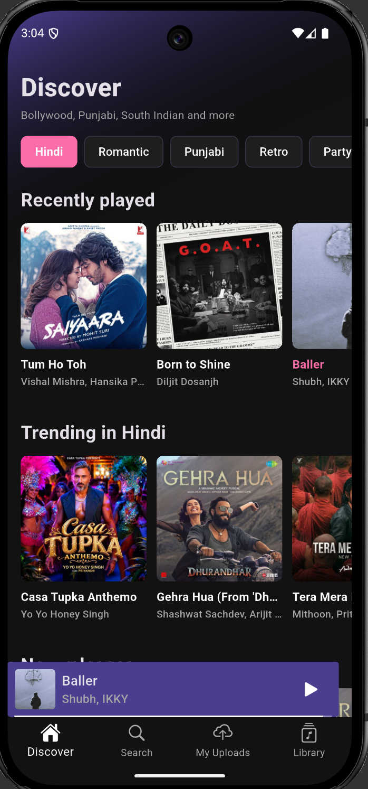
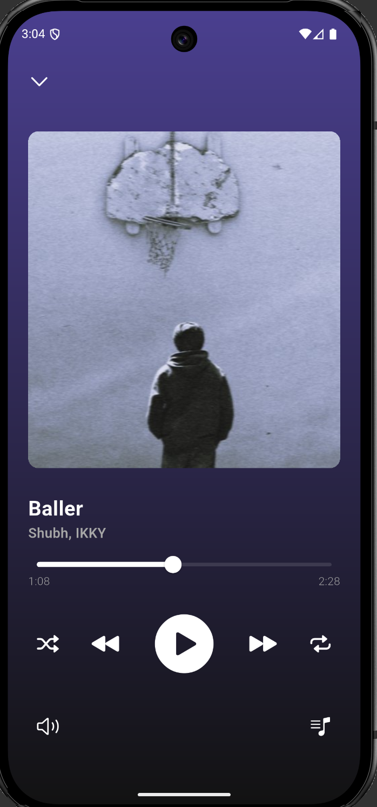

# Echo — Music Streaming App (Flutter Client)

Echo is a cross-platform music streaming app built with Flutter. Browse trending and new releases by language or mood, search songs, play them with background playback, upload your own tracks, and keep a library of favourites.

> **Server (FastAPI backend):** [github.com/DevSamyak/Echo](https://github.com/DevSamyak/Echo)

## Screenshots

<p align="center">
  
  &nbsp;&nbsp;&nbsp;
  
</p>

<p align="center"><i>Discover (left) and the full-screen player (right)</i></p>

## Features

- **Authentication** — sign up / log in with the Echo server; the session is cached locally so the app opens straight to the home screen.
- **Discover** — language and mood chips (Hindi, Romantic, Punjabi, Retro, Party, …) with *Trending*, *New releases* and *Recently played* rows.
- **Search** — find songs through the Echo server.
- **Player** — mini player bar plus a full-screen player with seek bar, play/pause, next/previous, shuffle and repeat.
- **Background playback** — keeps playing with the screen off, with notification controls.
- **My Uploads** — upload your own songs (audio file + thumbnail) to the server.
- **Library** — favourite songs, stored on the server and available across sessions.
- **Caching** — client-side caching (Hive) for fast loads, backed by a server-side feed cache.

## Tech Stack

| Layer | Tech |
|---|---|
| UI | Flutter (Material, dark theme) |
| State management | Riverpod (`flutter_riverpod`, `riverpod_generator`) |
| Audio | `just_audio`, `just_audio_background` |
| Networking | `http`, `fpdart` for typed error handling |
| Local storage | Hive, `shared_preferences` |
| Images | `cached_network_image` |
| Backend | FastAPI + PostgreSQL (see the [server repo](https://github.com/DevSamyak/Echo)), hosted on Render |

## Project Structure

```
lib/
├── core/            # theme, constants, shared widgets, providers, models
├── features/
│   ├── auth/        # signup, login, repositories, viewmodel
│   └── home/        # discover, search, uploads, library, player widgets
└── main.dart
```

The app follows an MVVM-style layout per feature: `view` → `viewmodel` → `repositories` → `model`.

## Getting Started

### Prerequisites

- Flutter SDK (Dart `^3.12.2`)
- An Android device/emulator (or any other Flutter-supported target)
- The Echo server running — either deployed or locally (see the [server repo](https://github.com/DevSamyak/Echo))

### Setup

```bash
# 1. Clone the client
git clone <your-client-repo-url>
cd Echo-Client

# 2. Install dependencies
flutter pub get

# 3. Generate Riverpod code
dart run build_runner build --delete-conflicting-outputs
```

### Point the app to your server

Edit `lib/core/constants/server_constants.dart`:

```dart
class ServerConstants {
  static String serverUrl = "https://your-echo-server-url";
}
```

> Android emulator talking to a local server? Use `http://10.0.2.2:<port>` instead of `localhost`.

### Run

```bash
flutter run
```

## Note on Cold Starts

The backend runs on a free Render instance, which sleeps when idle. The first request after a while can take a short time to respond; later requests are fast thanks to caching.

## Disclaimer

Echo is a personal, educational project. It does not host or distribute any copyrighted audio. Song metadata, artwork and streams for the Discover and Search sections are fetched at runtime through a third-party service; all songs, album art and trademarks shown in the screenshots belong to their respective owners. Songs uploaded through *My Uploads* are the responsibility of the uploader.


## License & Usage

Copyright © 2026 Samyak Bansod. Licensed under the
[PolyForm Noncommercial License 1.0.0](LICENSE).

This project is intended for educational and learning purposes.

**You are free to:**
- Clone the repository
- Study the source code
- Run it locally
- Modify and experiment with the code
- Create substantially modified versions for non-commercial use

**You may not:**
- Use the project commercially
- Sell the original project
- Redistribute the original source code as your own
- Upload an unchanged or substantially similar copy as your own project
- Remove copyright/attribution notices

For commercial use, please contact the author for permission:
[@DevSamyak](https://github.com/DevSamyak).

If anything in this summary conflicts with the `LICENSE` file, the `LICENSE` file governs.
The license covers the source code only. Song metadata, artwork and trademarks shown in the
app and screenshots belong to their respective owners (see the Disclaimer above).

## Author

**Samyak Bansod** — [@DevSamyak](https://github.com/DevSamyak)
